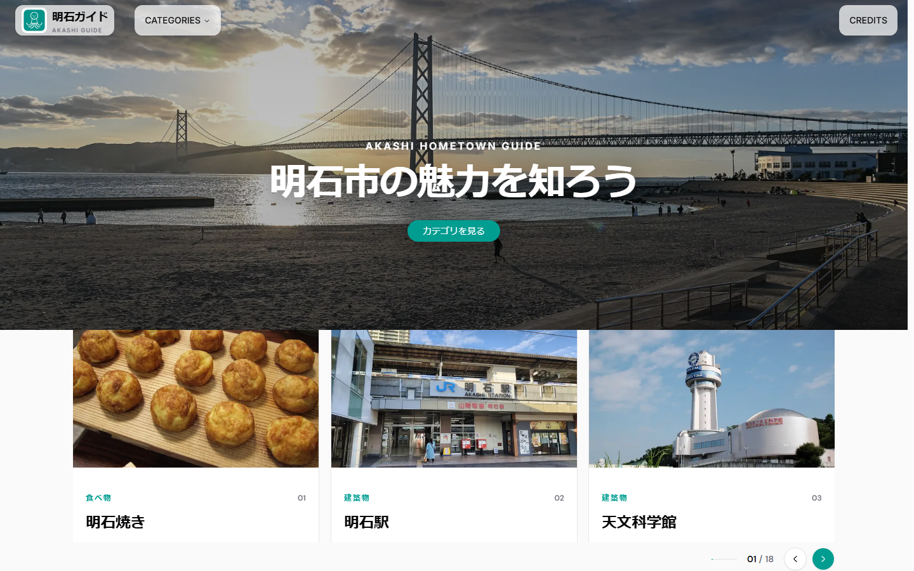
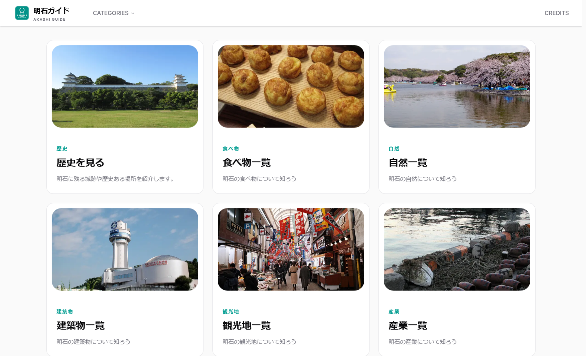
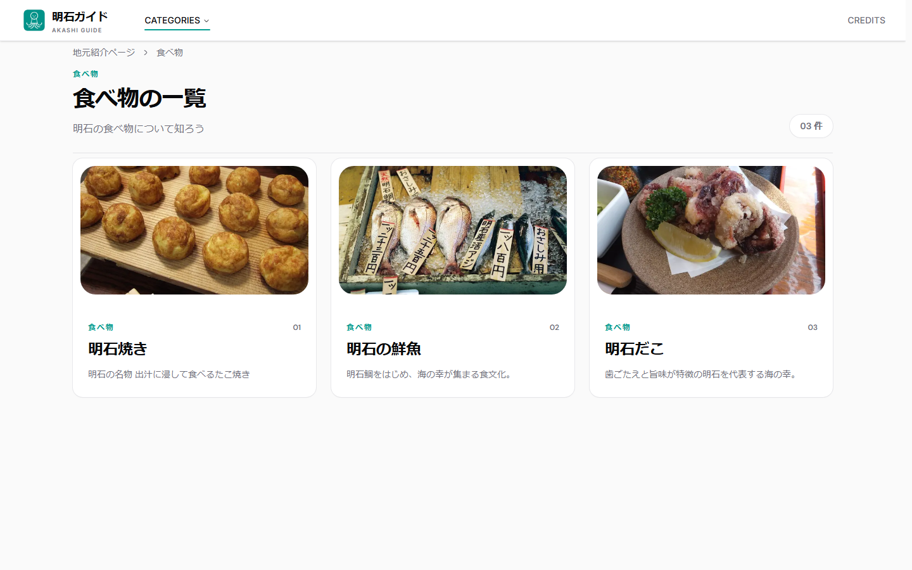
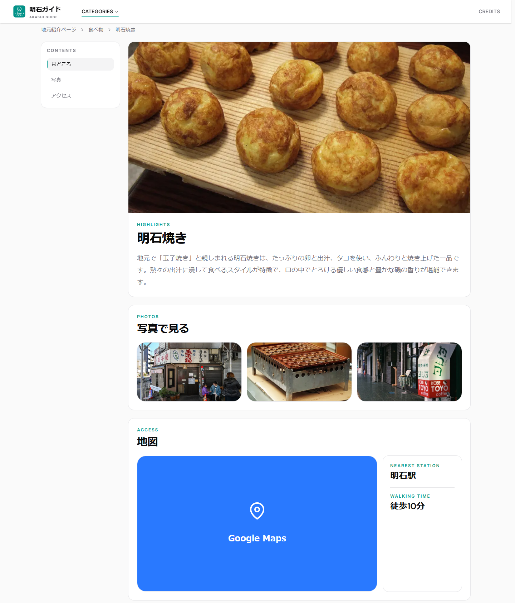
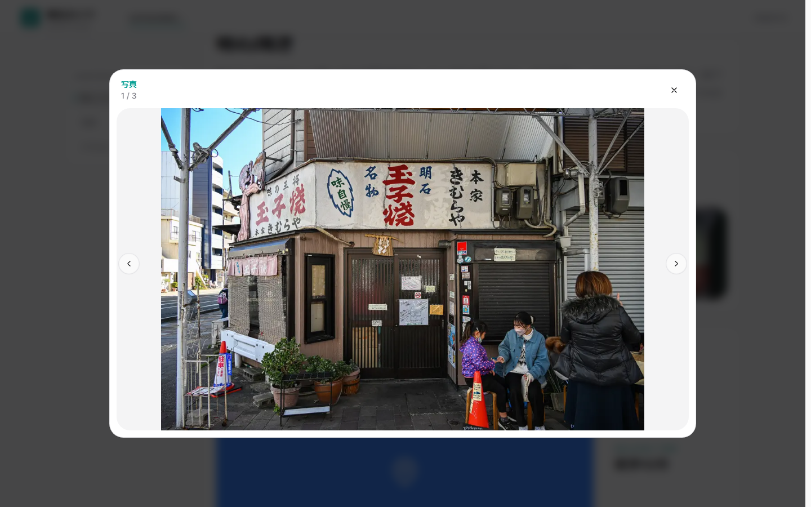
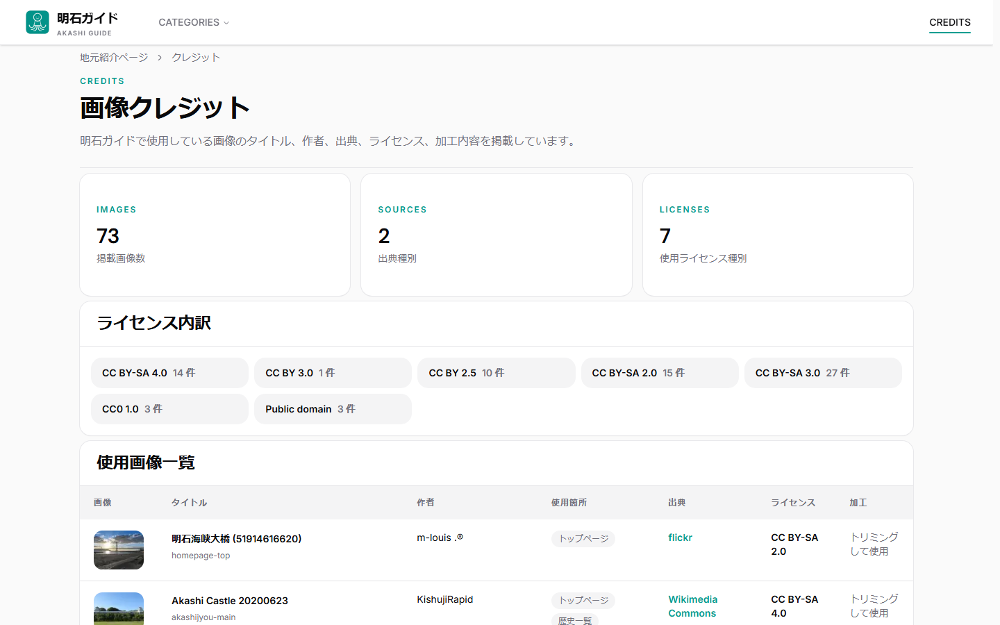
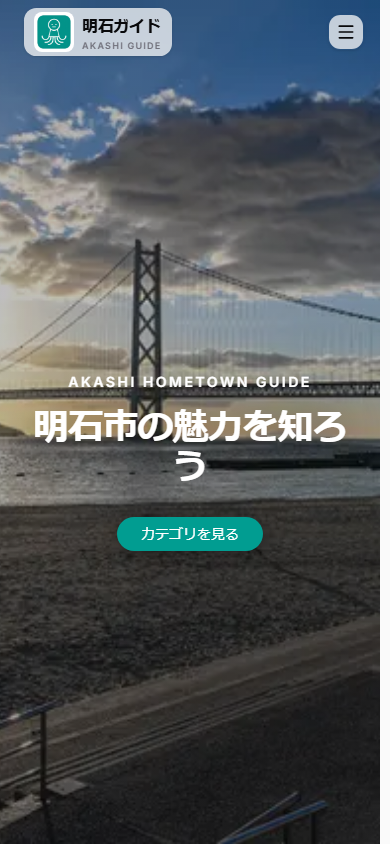
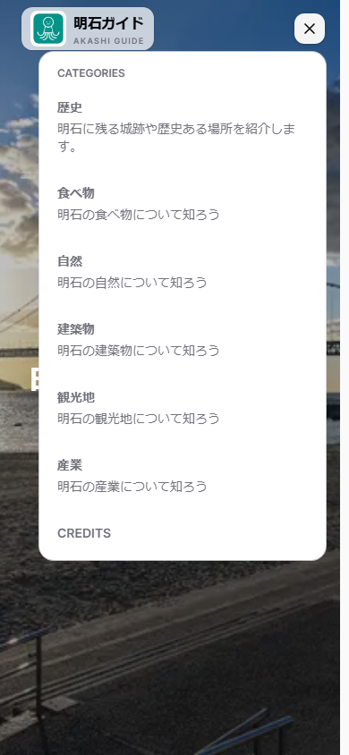
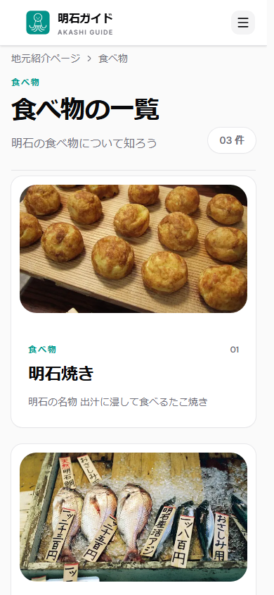

# 明石ガイド - AKASHI GUIDE

兵庫県明石市の歴史・食べ物・自然・建築物・観光地・産業をカテゴリ別に紹介する地元ガイドWebアプリケーション。C# / Blazor 版を Next.js (App Router) + TypeScript + Tailwind CSS + shadcn/ui で再構築しました。

## 開発背景

この制作はIT系専門学校のui/uxを競い合う学内コンテストのために作成しました。結果としてはクラス🏆1位　学年🏆2位を獲得できました。

## 機能一覧

- **ヒーローアニメーション** -- 明石海峡大橋の全画面ヒーロー画像と Motion によるスライドインアニメーション、`prefers-reduced-motion` 対応
- **人気順カルーセル** -- Embla Carousel と Upstash Redis でアクセス数順に自動ソート・3秒間隔で自動スクロール
- **カテゴリグリッド** -- 6カテゴリをカードグリッドで表示、ホバー時に対象以外を暗くする CSS `:has()` 演出
- **動的ルーティング詳細ページ** -- `[categoryKey]/[itemId]` ルーティング、IntersectionObserver による目次自動ハイライト
- **フォトギャラリー** -- キーボード操作対応（矢印キー / Esc / Tab）のライトボックスモーダル、`aria-modal` 対応
- **レスポンシブ対応** -- モバイルハンバーガーメニュー、ヘッダー透過切替、パンくずリスト
- **Vercel Analytics / Speed Insights** -- ページビュー分析とパフォーマンス測定を統合

## スクリーンショット

### デスクトップ

<picture>
  <source srcset="public/images/readme/hero-top.webp" type="image/webp">
  
</picture>

人気スポットが3秒ごとに自動スクロールするカルーセル。アクセス数順にソート表示。

6つのカテゴリカード。

選択したカテゴリに属するスポットの一覧をカード形式で表示。

見どころ・フォトギャラリー・アクセスの3セクション構成。スクロールに応じて目次が自動ハイライト。

サムネイルクリックで開くライトボックスモーダル。キーボード操作に対応。

全画像の出典情報を一覧表示するクレジットページ。デスクトップではテーブル、モバイルではカードで表示。

### モバイル

  
  

ハンバーガーメニューを開いた状態。外部クリックで自動的に閉じる。

## 使用技術

| カテゴリ             | 技術                                 |
| :------------------- | :----------------------------------- |
| **フレームワーク**   | Next.js 16 (App Router)              |
| **ライブラリ**       | React 19                             |
| **言語**             | TypeScript 5                         |
| **スタイリング**     | Tailwind CSS 4                       |
| **UIコンポーネント** | shadcn/ui (Radix UI ベース)          |
| **アニメーション**   | Motion（旧 Framer Motion）           |
| **カルーセル**       | Embla Carousel                       |
| **アイコン**         | Hugeicons                            |
| **データストア**     | Upstash Redis（アクセスカウント）    |
| **ホスティング**     | Vercel（Analytics / Speed Insights） |
| **フォント**         | Inter + DM Sans（Google Fonts）      |
| **E2Eキャプチャ**    | Playwright                           |

## クレジット

アプリ内の [クレジットページ](/credits) にて、使用した画像・素材の出典を掲載しています。
